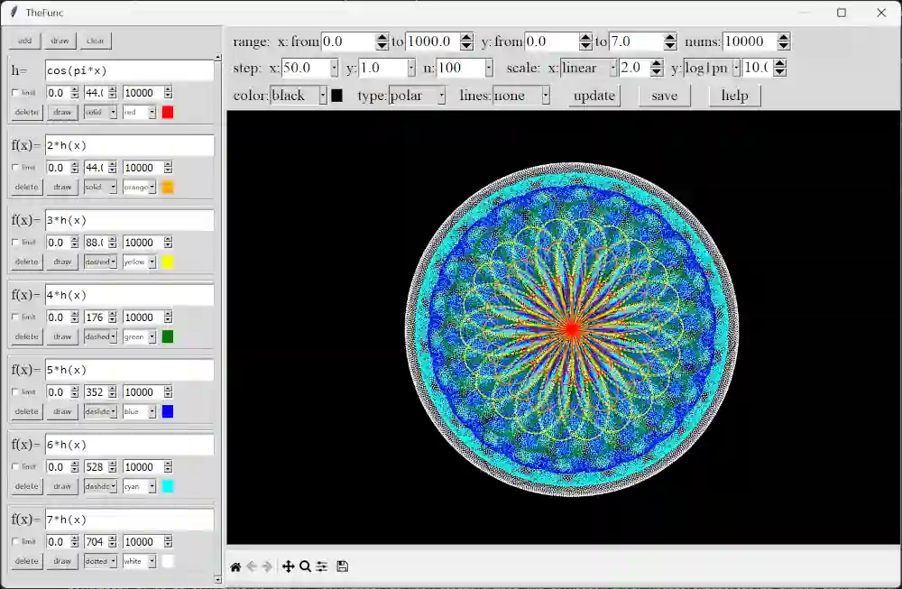

# The Func Help

**TheFuncEval** module provides handwritten methods by simply wrapping a large number of real functions from numpy and scipy.
**TheFunc** assembles a simple visual GUI program using matplotlib and tkinter. Below is a detailed explanation of both.
**Github:** <https://github.com/Govis-Ink/Govis/blob/TheFunc>



## The Func Eval

The following is the mathematical function dictionary for TheFuncEval:

```pyhton
    __func_dict = {
        '__builtins__':None,
        'int':int, 'float':float,
        'e':np.e, 'pi':np.pi, 'nan':np.nan, 'inf':np.inf,
        'sqrt':np.sqrt, 'cbrt':np.cbrt, 'sinc':np.sinc,
        'sin':np.sin, 'cos':np.cos, 'tan':np.tan,
        'arcsin':np.arcsin, 'arccos':np.arccos, 'arctan':np.arctan,
        'asin':np.asin, 'acos':np.acos, 'atan':np.atan,
        'sinh':np.sinh, 'cosh':np.cosh, 'tanh':np.tanh,
        'arcsinh':np.arcsinh, 'arccosh':np.arccosh, 'arctanh':np.arctanh,
        'asinh':np.asinh, 'acosh':np.acosh, 'atanh':np.atanh,
        'deg':np.degrees, 'rad':np.radians,
        'round':np.round, 'floor':np.floor, 'ceil':np.ceil, 'trunc':np.trunc,
        'exp':np.exp, 'expm1':np.expm1, 'exp2':np.exp2,
        'log':np.log, 'log1p':np.log1p, 'log2':np.log2, 'log10':np.log10,
        'min':np.min, 'max':np.max,
        'lcm':np.lcm, 'gcd':np.gcd,
        'add':np.add, 'rec':np.reciprocal,
        'positive':np.positive, 'negative':np.negative, 'sign':np.sign, 'signbit':np.signbit, 'fabs':np.fabs, 'abs':np.abs,
        'mul':np.multiply, 'div':np.divide, 'pow':np.power, 'fmod':np.fmod, 'mod':np.mod,
        'der':der_func, 'sim':sim_func, 'sder':sder_func,
        'diff':diff_func, 'difb':difb_func, 'cum':cum_func, 'ddif':ddif_func, 'dcum':dcum_func,
        'jv':sc.jv, 'jve':sc.jve, 'yn':sc.yn, 'yv':sc.yv, 'yve':sc.yve,
        'iv':sc.iv, 'ive':sc.ive, 'kn':sc.kn, 'kv':sc.kv, 'kve':sc.kve,
        'j0':sc.j0, 'j1':sc.j1, 'y0':sc.y0, 'y1':sc.y1,
        'i0':sc.i0, 'i0e':sc.i0e, 'i1':sc.i1, 'i1e':sc.i1e,
        'k0':sc.k0, 'k0e':sc.k0e, 'k1':sc.k1, 'k1e':sc.k1e,
        'struve':sc.struve, 'modstruve':sc.modstruve, 'itstruve0':sc.itstruve0,
        'it2struve0':sc.it2struve0, 'itmodstruve0':sc.itmodstruve0,
        'bdtr':sc.bdtr, 'bdtrc':sc.bdtrc, 'bdtri':sc.bdtri, 'bdtrik':sc.bdtrik, 'bdtrin':sc.bdtrin,
        'btdtria':sc.btdtria, 'btdtrib':sc.btdtrib,
        'fdtr':sc.fdtr, 'fdtrc':sc.fdtrc, 'fdtri':sc.fdtri, 'fdtridfd':sc.fdtridfd,
        'gdtr':sc.gdtr, 'gdtrc':sc.gdtrc, 'gdtria':sc.gdtria, 'gdtrib':sc.gdtrib, 'gdtrix':sc.gdtrix,
        'nbdtr':sc.nbdtr, 'nbdtrc':sc.nbdtrc, 'nbdtri':sc.nbdtri, 'nbdtrik':sc.nbdtrik, 'nbdtrin':sc.nbdtrin,
        'ncfdtr':sc.ncfdtr, 'ncfdtridid':sc.ncfdtridfd, 'ncfdtridfn':sc.ncfdtridfn, 'ncfdtri':sc.ncfdtri, 'ncfdtrinc':sc.ncfdtrinc,
        'nctdtr':sc.nctdtr, 'nctdtridf':sc.nctdtridf, 'nctdtrit':sc.nctdtrit, 'nctdtrinc':sc.nctdtrinc,
        'nrdtrimn':sc.nrdtrimn, 'nrdtrisd':sc.nrdtrisd, 'ndtr':sc.ndtr, 'logndtr':sc.log_ndtr, 'ndtri':sc.ndtri, 'ndtrie':sc.ndtri_exp,
        'pdtr':sc.pdtr, 'pdtrc':sc.pdtrc, 'pdtri':sc.pdtri, 'pdtrik':sc.pdtrik,
        'stdtr':sc.stdtr, 'stdtridf':sc.stdtridf, 'stdtrit':sc.stdtrit,
        'chdtr':sc.chdtr, 'chdtrc':sc.chdtrc, 'chdtri':sc.chdtri, 'chdtriv':sc.chdtriv,
        'chndtr':sc.chndtr, 'chndtridf':sc.chndtridf, 'chndtrinc':sc.chndtrinc, 'chndtrix':sc.chndtrix,
        'smirnov':sc.smirnov, 'smirnovi':sc.smirnovi, 'kolmogorov':sc.kolmogorov, 'kolmogi':sc.kolmogi,
        'boxcox':sc.boxcox, 'boxcox1p':sc.boxcox1p, 'invboxcox':sc.inv_boxcox, 'invboxcox1p':sc.inv_boxcox1p,
        'logit':sc.logit, 'expit':sc.expit, 'logexpit':sc.log_expit,
        'tklambda':sc.tklmbda, 'owens':sc.owens_t,
        'entr':sc.entr, 'relentr':sc.rel_entr, 'kldiv':sc.kl_div, 'huber':sc.huber, 'phuber':sc.pseudo_huber,
        'gamma':sc.gamma, 'gammaln':sc.gammaln, 'loggamma':sc.loggamma, 'gammasgn':sc.gammasgn,
        'gammainc':sc.gammainc, 'gammaincinv':sc.gammaincinv,
        'gammaincc':sc.gammaincc, 'gammainccinv':sc.gammainccinv,
        'beta':sc.beta, 'betaln':sc.betaln, 'betainc':sc.betainc, 
        'betaincc':sc.betaincc, 'betaincinv':sc.betaincinv, 'betainccinv':sc.betainccinv,
        'psi':sc.psi, 'rgamma':sc.rgamma, 'digamma':sc.digamma, 'poch':sc.poch,
        'erf':sc.erf, 'erfc':sc.erfc, 'erfcx':sc.erfcx, 'erfi':sc.erfi, 'erfinv':sc.erfinv,
        'erfcinv':sc.erfcinv, 'dawns':sc.dawsn, 'voigt':sc.voigt_profile, 'lpmv':sc.lpmv,
        'legendre':sc.eval_legendre, 'chebyt':sc.eval_chebyt, 'chebyu':sc.eval_chebyu, 'chebyc':sc.eval_chebyc,
        'chebys':sc.eval_chebys, 'jacobi':sc.eval_jacobi, 'laguerre':sc.eval_laguerre, 'genlaguerre':sc.eval_genlaguerre,
        'hermite':sc.eval_hermite, 'hermitenorm':sc.eval_hermitenorm, 'gegenbauer':sc.eval_gegenbauer, 'shlegendre':sc.eval_sh_legendre, 
        'shchebyt':sc.eval_sh_chebyt, 'shchebyu':sc.eval_sh_chebyu, 'shjacobi':sc.eval_sh_jacobi,
        'hyp2f1':sc.hyp2f1, 'hyp1f1':sc.hyp1f1, 'hyperu':sc.hyperu, 'hyp0f1':sc.hyp0f1,
        'mathieua':sc.mathieu_a, 'mathieub':sc.mathieu_b, 'mathieucem':sc.mathieu_cem, 'mathieusem':sc.mathieu_sem,
        'mathieumodcem1':sc.mathieu_modcem1, 'mathieumodcem2':sc.mathieu_modcem2,
        'mathieumodsem1':sc.mathieu_modcem1, 'mathieumodsem2':sc.mathieu_modsem2,
        'proang1':sc.pro_ang1, 'prorad1':sc.pro_rad1, 'prorad2':sc.pro_rad2,
        'oblang1':sc.obl_ang1, 'oblrad1':sc.obl_rad1, 'oblrad2':sc.obl_rad2,
        'procv':sc.pro_cv, 'oblcv':sc.obl_cv,
        'proang1cv':sc.pro_ang1_cv, 'prorad1cv':sc.pro_rad1_cv, 'prorad2cv':sc.pro_rad2_cv,
        'bolang1cv':sc.obl_ang1_cv, 'oblrad1cv':sc.obl_rad1_cv, 'oblrad2cv':sc.obl_rad2_cv,
        'kelvin':sc.kelvin, 'ber':sc.ber, 'bei':sc.bei, 'berp':sc.berp,
        'beip':sc.beip, 'ker':sc.ker, 'kei':sc.kei, 'kerp':sc.kerp, 'keip':sc.keip,
        'agm':sc.agm, 'binom':sc.binom, 'expn':sc.expn, 'spence':sc.spence,'zeta':sc.zetac,
        'sindg':sc.sindg, 'cosdg':sc.cosdg, 'tandg':sc.tandg, 'cotdg':sc.cotdg,
        'powm1':sc.powm1, 'xlogy':sc.xlogy, 'xlog1py':sc.xlog1py, 'exprel':sc.exprel,
        'pdf':lambda stats: stats.pdf, 'logpdf':lambda stats: stats.logpdf,
        'cdf':lambda stats: stats.cdf, 'logcdf':lambda stats: stats.logcdf,
        'sf':lambda stats: stats.sf, 'logsf':lambda stats: stats.logsf,
        'ppf':lambda stats: stats.ppf, 'isf':lambda stats: stats.isf,
        'norm':st.norm, 'cauchy':st.cauchy, 'laplace':st.laplace,
        'logistic':st.logistic, 'skewnorm':st.skewnorm, 'genlogistic':st.genlogistic,  
        'levy':st.levy, 't':st.t, 'cosine':st.cosine, 'arcsine':st.arcsine,
        'dgamma':st.dgamma, 'powernorm':st.powernorm, 'kappa4':st.kappa4, 'kappa3':st.kappa3,
        'alpha':st.alpha, 'anglit':st.anglit, 'argus':st.argus, 'betas':st.beta,
        'betaprime':st.betaprime, 'bradford':st.bradford, 'byrr':st.burr,
        'chi':st.chi, 'chi2':st.chi2, 'crystallball':st.crystalball, 'dweibull':st.dweibull,
        'erlang':st.erlang, 'expon':st.expon, 'exponnorm':st.exponnorm, 'exponweib':st.exponweib,
        'exponpow':st.exponpow, 'f':st.f, 'fatiguelife':st.fatiguelife, 'fisk':st.fisk,
        'foldnorm':st.foldnorm, 'genlogistic':st.genlogistic, 'gennorm':st.gennorm,
        'genpareto':st.genpareto, 'genexpon':st.genexpon, 'genextreme':st.genextreme,
        'gausshyper':st.gausshyper, 'gengamma':st.gengamma, 'genhalflogistic':st.genhalflogistic,
        'genhyperbolic':st.genhyperbolic, 'geninvgauss':st.geninvgauss, 'gibrat':st.gibrat,
        'gompertz':st.gompertz, 'gumbelr':st.gumbel_r, 'gumbell':st.gumbel_l,
        'halfcauchy':st.halfcauchy, 'halflogistic':st.halflogistic, 'halfnorm':st.halfnorm,
        'halfgennorm':st.halfgennorm, 'hypsecant':st.hypsecant, 'invgamma':st.invgamma,
        'invguass':st.invgauss, 'invweibull':st.invweibull, 'irwinhall':st.irwinhall,
        'jfskewt':st.jf_skew_t, 'johnsonsb':st.johnsonsb, 'johnsonsu':st.johnsonsu,
        'ksone':st.ksone, 'kstwo':st.kstwo, 'kstwobign':st.kstwobign,
        'landau':st.landau, 'levyl':st.levy_l, 'levys':st.levy_stable, 
        'lomax':st.lomax, 'maxwell':st.maxwell, 'mielke':st.mielke,
        'moyal':st.moyal, 'nakagami':st.nakagami, 'ncx2':st.ncx2,
        'ncf':st.ncf, 'nct':st.nct, 'norminvguass':st.norminvgauss,
        'pareto':st.pareto, 'pearson3':st.pearson3, 'powerlaw':st.powerlaw,
        'powerlognorm':st.powerlognorm, 'powernorm':st.powernorm, 'rdist':st.rdist,
        'rayleigh':st.rayleigh, 'rice':st.rice, 'recipinvguass':st.recipinvgauss,
        'relbreitwigner':st.rel_breitwigner, 'semicicular':st.semicircular,
        'skewcauthy':st.skewcauchy, 'trapezoid':st.trapezoid, 'triang':st.triang,
        'truncexpon':st.truncexpon, 'truncnorm':st.truncnorm, 'truncpareto':st.truncpareto,
        'truncweibullmin':st.truncweibull_min, 'tukeylambda':st.tukeylambda,
        'uniform':st.uniform, 'vonmises':st.vonmises, 'vonmisesline':st.vonmises_line,
        'wald':st.wald, 'weibullmin':st.weibull_min, 'weibullmax':st.weibull_max, 'wrapcauchy':st.wrapcauchy
    }
```

## The Func

The following are the components of TheFunc and their respective functions:

```txt
    1. Function Manager (Left Panel)
    - Add multiple functions to plot simultaneously
    - Each function has independent settings:
        · Expression input field
        · Domain range (enable/disable limit)
        · Number of sampling points
        · Line style (solid, dashed, dashdot, dotted)
        · Line color (red, green, blue, black, white, cyan, magenta, yellow, orange, purple, pink, brown, gray, gold)
    - Buttons: delete, draw (single function)
    - Top buttons: add, draw all, clear all

    1. Coordinate Axis Controls (Right Panel - Top)
    - Range Settings:
        · X-axis: from / to
        · Y-axis: from / to
        · Number of points: 1,000 to 1,000,000
    - Step Settings:
        · X-axis step, Y-axis step
        · N step (for sampling increment)
    - Scale Transformations (X/Y independently):
        · linear, symlog
        · expit, erf, norm, cauchy, laplace, cosine
        · sin, cos, arctan, tanh
        · square, cube
        · exp, log1p
        · nx, pown, expn, log1pn (adjustable base n)
    - Appearance:
        · Background color
        · Axis type: normal, equal, polar
        · Grid line style: solid, dashed, dashdot, dotted, none
    - Buttons: update (apply all changes), save (export image), help

    1. Plot Area (Right Panel - Bottom)
    - Displays function curves
    - Built-in matplotlib toolbar:
        · Home (reset view)
        · Pan (drag to move)
        · Zoom (rectangle zoom)
        · Save (export current figure)
    - Mouse wheel support for scrolling
```

## Function Input Rules

The following are the function input rules for TheFunc:

```txt
    · The function and its plot are updated only when you click the "draw" or "update" button.
    · Each function entry can have only one curve at a time.
    · For calculus operators, the inner function must use 't' as the formal variable, while all outer functions must use 'x'.
    · If the expression cannot be parsed or evaluated, the entry will turn red until a valid input is provided.
    · You can define a custom function using an assignment statement, which changes the label name.  
    Example: "g = x**2" creates a function g, and calling g(x) returns x**2.
    · Custom function names can only consist of letters and digits, and must be 1 to 4 characters long.  
    If the definition is valid but the name is invalid, the entry turns blue and no custom function is created.
    · Custom functions have a recursion limit of 30. A function that requires 30 or more recursive calls is invalid.
    · Custom functions are bound to the definition; updating the expression also changes the definition.
    · When a custom function entry is deleted, its definition is also removed.
    · Using an assignment statement on an existing custom function overwrites its name and definition.
    · Using 'f(x)' as the custom function name clears the custom definition.
    · Built-in functions cannot be overwritten.
    · Entering an empty string or pure spaces clears the corresponding curve (restores the entry color) but does not change the custom function definition.
    · 'f(x)=' is different from a custom assignment; an empty definition clears the custom function,
       but a custom assignment requires a non-empty valid definition.
    · 'inf' and 'der' are disabled in function input because they tend to cause crashes. Use 'sder' for derivatives.
    · Avoid extremely fast-growing expressions such as 'sim(exp(t**2))(0,x)', which may cause register overflow.
```
